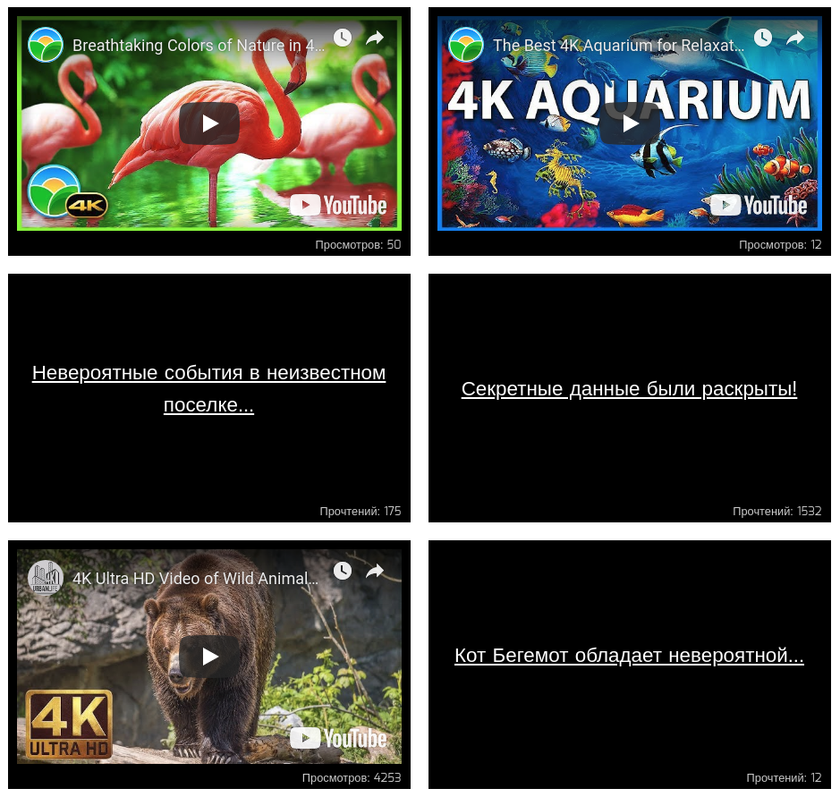

[Ссылка на Github Pages](https://juliesoboleva.github.io/react-highlight/)

Подсвечивание блоков
===

На нашем сайте есть блоки со статьями и с видеозаписями. 

Мы решили улучшить отображение наших блоков таким образом, чтобы популярные статьи и видео, у которых 1000+ прочтений или просмотров,
оборачивались в компонент `Popular`, а с количеством до 100 — в компонент `New`. Эти компоненты будут менять внешний облик блоков, привлекая внимание посетителей.

## Реализация

Используя HOC, обернуть `Video` и `Article` таким образом, чтобы при отображении в компоненте `List` они помещались внутрь требуемого компонента `Popular` или `New`.

Воспользуйтесь готовым файлом `App.js` и стилями `css/index.css` из каталога в качестве отправной точки. Замените ими те, что создаются в create-react-app.
